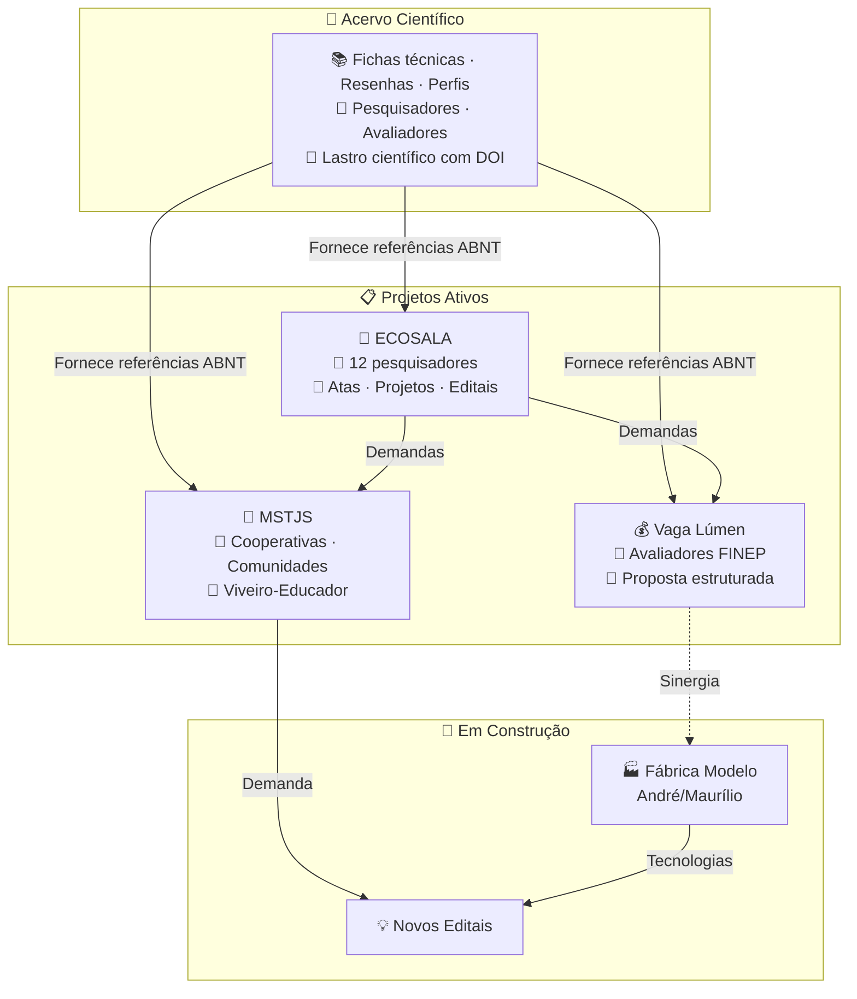

# 📚 Análises e Escrita Científica

> ⚠️ **Compartilhamento seletivo** — Este repositório não é de acesso público irrestrito. Recomendamos o compartilhamento apenas com pessoas que tenham vínculo direto com o propósito: cooperativas, pesquisadores, analistas de editais, avaliadores e orientadores. A entrada de novos membros no ecossistema se dá exclusivamente por conexão com um projeto irmão ativo — não por convite aberto.
>
> 🎋 **Acelerador de resultados, não vitrine** — Como o bambu, que não cresce isolado mas em rede de rizomas subterrâneos, cada repositório deste ecossistema só ganha sentido quando vinculado a um projeto real. Não expomos conhecimento para validação externa — aceleramos quem está na ponta.
>
> Trabalhamos sob duas bússolas. As **7 Lições do Bambu** nos lembram que é preciso curvar sem quebrar, criar raízes profundas, cooperar em comunidade, crescer com foco, colecionar nós de aprendizado, permanecer ocos de certezas e buscar o bem comum. Os **7 Pilares de Edgar Morin** para a educação do futuro nos ancoram no pensamento complexo: o conhecimento só é pertinente quando enfrenta a incerteza, ensina a condição humana e se compromete com a ética.
>
> 📚 **Este repositório** é a memória científica do ecossistema — fichas técnicas, estados da arte e resenhas com DOI rastreável que dão lastro a editais, cartas de anuência e decisões de projeto. Nenhuma ficha é publicada sem autor, fonte verificada e as 8 seções do protocolo Cavichioli (2025).

👉 **Site:** https://takwaratec.github.io/Analises-e-escrita-cientifica/

---

## 🧭 O que é este repositório

Aqui fica o **acervo científico** que fundamenta todos os projetos irmãos. Cada ficha é baseada em material bruto original (artigos com DOI, teses, dissertações, relatórios técnicos), seguindo a metodologia dos **200+ Prompts para Escrita Científica** (Cavichioli, 2025).

| Repositório | O que é | Para quem | Relação com os irmãos |
|---|---|---|---|
| 📚 **Acervo Científico** | Memória técnica: fichas, resenhas, estados da arte com DOI | Pesquisadores, avaliadores de editais, orientadores | Fornece lastro científico para todos os projetos |
| 🌱 **ECOSALA** | Coletivo de 12 pesquisadores: atas, projetos, articulação | Membros do coletivo, parceiros institucionais | Recebe lastro do Acervo; demanda editais |
| 💰 **Vaga Lúmen** | Proposta FINEP Mais Inovação | Avaliadores FINEP, equipe técnica | Transforma ciência do Acervo em projeto |
| 🌾 **MSTJS** | Viveiro-Educador no Assentamento Mário Lago | Cooperativas, comunidades, financiadores | Ponte entre teoria e chão |
| 🔮 **Fábrica Modelo** | Prototipagem industrial — em discussão | André Blanco, Maurílio | Recebe sinergia; alimenta novos editais |

---

## 📂 Eixos temáticos

### Tecnologia Takwara — 8 sub-eixos (257 fichas)

O eixo principal, oriundo da triagem do acervo Takwara-Tech (83 PDFs + 15 áudios), foi ramificado em 8 sub-eixos temáticos:

| # | Sub-eixo | Fichas | Conteúdo |
|---|----------|--------|----------|
| 01 | **Núcleo Tecnológico** | 63 | PU Vegetal, Imperveg, patentes, mamona, poliuretano |
| 02 | **Tratamento do Bambu** | 60 | Pirolenhoso, térmico, tanino, preservação, MPTDF |
| 03 | **Materiais Compósitos** | 29 | BLC, OSB, fibras, biocompósitos, geodésicas |
| 04 | **Habitação e Construção** | 28 | HIS, domos, geodésicas, moradia social |
| 05 | **Meio Ambiente e Clima** | 25 | Carbono, ACV, carvão, mudanças climáticas |
| 06 | **Manejo e Ecologia** | 7 | Espécies, zoneamento, manejo florestal |
| 07 | **Governança e Projetos** | 9 | Editais, protocolos, advocacy, gestão |
| 08 | **Perfis e Referências** | 29 | Pesquisadores, IFB, referências acadêmicas |
|| — | **Outros** | 7 | Não classificados |

### 🆕 Últimas adições (29/06/2026)

| Ficha | Sub-eixo | Tema |
|---|---|---|
| `ficha-certificacao-leed.md` | Governança e Projetos | LEED — certificação USGBC |
| `ficha-certificacao-aqua-hqe.md` | Governança e Projetos | AQUA-HQE — Fundação Vanzolini |
| `ficha-certificacao-casa-azul.md` | Governança e Projetos | Selo Casa Azul + Caixa — HIS |
| `ficha-certificacao-verra-carbono.md` | Governança e Projetos | VERRA/VCS — créditos de carbono |
| `ficha-certificacao-gold-standard.md` | Governança e Projetos | Gold Standard — carbono + ODS |
| `ficha-acv-avaliacao-ciclo-vida.md` | Meio Ambiente e Clima | ACV — ISO 14040/44 |
| `ficha-impactos-producao-cimento.md` | Meio Ambiente e Clima | Impactos globais do cimento |

### Demais eixos (62 fichas)

| Eixo | Fichas | Conteúdo |
|------|--------|----------|
| **ECOSALA** | 25 | Fichas dos 12 membros + tecnologias sociais |
| **Bioeconomia Amazônica** | 22 | Cadeias sociobiodiversidade, diagnósticos territoriais |
| **Avaliação Pós-Ocupação** | 5 | APO, qualidade habitacional |
| **Política Habitacional** | 5 | HIS, PMCMV, políticas públicas |
| **Grandes Obras Amazônia** | 5 | Impactos de grandes empreendimentos |

> **Total: 319 fichas** (sendo 80 catálogos IFB de referência rápida, 239 fichas analíticas completas) — todas seguindo o protocolo Cavichioli de 8 seções, com DOI/ISBN sempre que disponível.

---

## 📋 Metodologia

As análises seguem o protocolo baseado nos **200+ Prompts para Escrever Artigos Científicos** (Cavichioli, 2025): extração → mapeamento estrutural → análise do referencial → avaliação metodológica → extração de achados → avaliação crítica → inserção no estado da arte.

Detalhes em: [`docs/metodologia.md`](docs/metodologia.md)

---

## 🛠️ Ferramentas

- **PyMuPDF** — extração de texto de PDFs
- **Hermes Agent** — análise assistida por IA, fichamento automatizado
- **MkDocs Material** — site e publicação
- **GitHub** — versionamento e deploy
- **ChromaDB + all-MiniLM-L6-v2** — busca semântica vetorial 100% local no acervo completo

---

## 📜 Licença

© Fabio Takwara, 2026. CC BY 4.0. Citações de terceiros mantêm seus direitos autorais originais.

---

*Atualizado: 29/06/2026 · Tecnologia Takwara*
