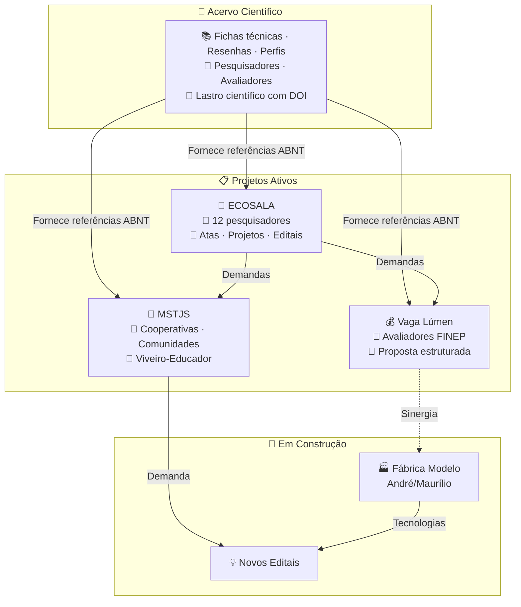

# 📚 Análises e Escrita Científica

> ⚠️ **Compartilhamento seletivo** — Este repositório não é de acesso público irrestrito. Recomendamos o compartilhamento apenas com pessoas que tenham vínculo direto com o propósito: cooperativas, pesquisadores, analistas de editais, avaliadores e orientadores. A entrada de novos membros no ecossistema se dá exclusivamente por conexão com um projeto irmão ativo — não por convite aberto.
>
> 🎋 **Acelerador de resultados, não vitrine** — Como o bambu, que não cresce isolado mas em rede de rizomas subterrâneos, cada repositório deste ecossistema só ganha sentido quando vinculado a um projeto real. Não expomos conhecimento para validação externa — aceleramos quem está na ponta.
>
> Trabalhamos sob duas bússolas. As **7 Lições do Bambu** nos lembram que é preciso curvar sem quebrar, criar raízes profundas, cooperar em comunidade, crescer com foco, colecionar nós de aprendizado, permanecer ocos de certezas e buscar o bem comum. Os **7 Pilares de Edgar Morin** para a educação do futuro nos ancoram no pensamento complexo: o conhecimento só é pertinente quando enfrenta a incerteza, ensina a condição humana e se compromete com a ética.
>
> 📚 **Este repositório** é a memória científica do ecossistema — fichas técnicas, estados da arte e resenhas com DOI rastreável que dão lastro a editais, cartas de anuência e decisões de projeto. Nenhuma ficha é publicada sem autor, fonte verificada e as 8 seções do protocolo Cavichioli (2025).

👉 **Site:** https://takwaratec.github.io/Analises-e-escrita-cientifica/

---

## 🧭 O que é este repositório

Aqui fica o **acervo científico** que fundamenta todos os projetos irmãos. Cada ficha é baseada em material bruto original (artigos com DOI, teses, dissertações, relatórios técnicos), seguindo a metodologia dos **200+ Prompts para Escrita Científica**.

| Repositório | O que é | Para quem | Relação com os irmãos |
|---|---|---|---|
| 📚 **Acervo Científico** | Memória técnica: fichas, resenhas, estados da arte com DOI | Pesquisadores, avaliadores de editais, orientadores | Fornece lastro científico para todos os projetos |
| 🌱 **ECOSALA** | Coletivo de 12 pesquisadores: atas, projetos, articulação | Membros do coletivo, parceiros institucionais | Recebe lastro do Acervo; demanda editais para Vaga Lúmen e MSTJS |
| 💰 **Vaga Lúmen** | Proposta FINEP Mais Inovação: saneamento, habitação, bambu | Avaliadores FINEP, proponente, equipe técnica | Transforma ciência do Acervo em projeto; recebe demandas do ECOSALA |
| 🌾 **MSTJS** | Viveiro-Educador no Assentamento Mário Lago | Cooperativas, comunidades, financiadores | Ponte entre teoria e chão; capta editais próprios e articula com Fábrica Modelo |
| 🔮 **Fábrica Modelo** | Prototipagem industrial — em discussão | André Blanco, Maurílio | Recebe sinergia da Vaga Lúmen; alimenta novos editais |

---

## 📂 Eixos temáticos e acervo

| Eixo | Fichas | Conteúdo |
|---|---|---|
| **ECOSALA** | 22 | Fichas dos 12 membros + tecnologias |
| **Tecnologia Takwara** | 65 | Bambu, PU vegetal, compósitos, patentes |
| **Bioeconomia Amazônica** | 23 | Cadeias sociobiodiversidade, diagnósticos |
| **Habitação & Políticas** | 22 | HIS, APO, PMCMV, Grandes Obras |

| 🆕 | [AgroRadarEval](docs/analises/ecosala/ficha-agroradareval.md) | Daniela Maciel — Gestão de P&D orientada a impacto societal | DOI 10.4067/S0718-27242024000400089 |
| 🆕 | [TerImpact Ex-Ante](docs/analises/ecosala/ficha-terimpact-exante.md) | Daniela Maciel — Avaliação ex-ante de projetos | GitHub danimaciel |

> **Total: ~272 fichas + Catálogo IFB (70 referências)**

---

## 📋 Metodologia

As análises seguem o protocolo baseado nos **200+ Prompts para Escrever Artigos Científicos** (Cavichiolli, 2025): extração → mapeamento estrutural → análise do referencial → avaliação metodológica → extração de achados → avaliação crítica → inserção no estado da arte.

Detalhes em: [`docs/metodologia.md`](docs/metodologia.md)

---

## 🛠️ Ferramentas

- **PyMuPDF** — extração de texto de PDFs
- **Hermes Agent** — análise assistida por IA
- **MkDocs Material** — site e publicação
- **GitHub** — versionamento e deploy
- **AgroRadarEval** 🆕 — gestão de P&D orientada a impacto societal (Daniela Maciel, Embrapa)
- **TerImpact Ex-Ante** 🆕 — avaliação ex-ante e governança de projetos (Daniela Maciel, Embrapa)

---

## 📜 Licença

© Fabio Takwara, 2026. CC BY 4.0. Citações de terceiros mantêm seus direitos autorais originais.

---

*Atualizado: 26/06/2026 · Tecnologia Takwara*
