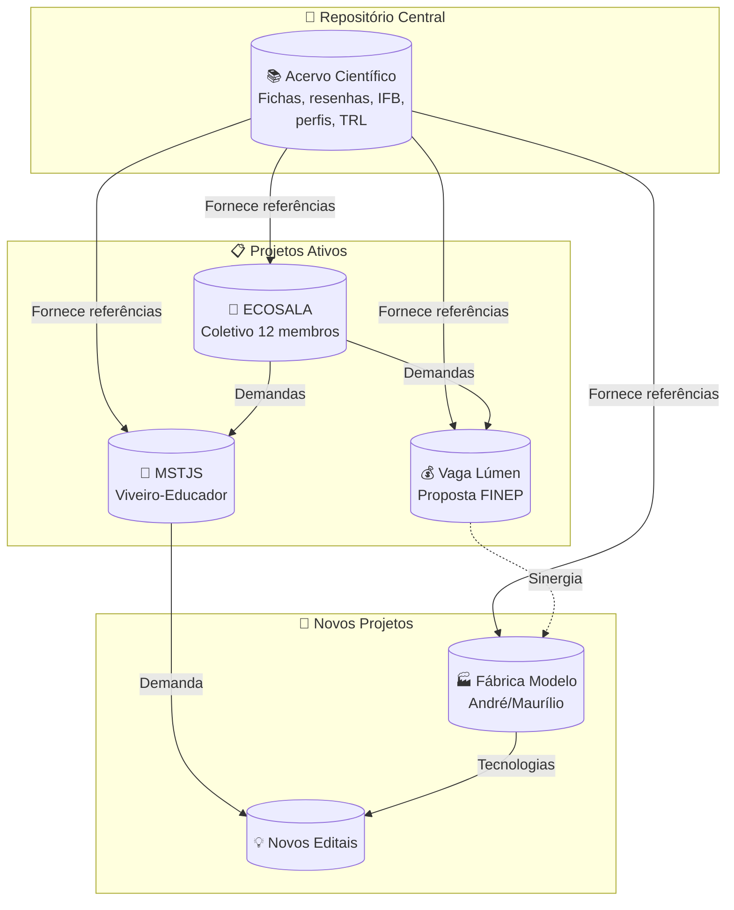

# 📚 Análises e Escrita Científica

> 🌿 **Bem Viver** — Somos um encontro de trajetórias diversas que convergem em um propósito comum: a construção de mundos onde a vida, em todas as suas formas, ocupe o centro das relações sociais, econômicas e políticas.
>
> Não há aqui uma única disciplina, uma única origem ou uma única voz. Somos agrônomos, arquitetos, microbiologistas, engenheiros, educadoras, nutricionistas, psicólogas, gestoras comunitárias, desenvolvedores e pesquisadores autodidatas. Atuamos em institutos federais, centros de pesquisa, universidades, assentamentos da reforma agrária, Áreas de Proteção Ambiental e periferias urbanas.
>
> O que nos une não é um título, mas uma convicção: a de que a ciência deve servir à terra e aos povos que nela habitam. Trabalhamos com agroecologia e bioconstrução, com bambu e poliuretano vegetal, com saneamento ecológico e bioeconomia regenerativa, com tecnologias sociais que emergem do chão das comunidades e retornam a elas como autonomia.
>
> Este repositório é parte desse ecossistema — a **memória científica** que fundamenta todos os projetos irmãos. Aqui documentamos, analisamos e compartilhamos o que aprendemos, sempre na escuta dos territórios e na companhia dos que vieram antes.
>
> Seja bem-vinda, bem-vindo. Há lugar para quem chega com vontade de aprender, contribuir e transformar.

**Repositório central de fichas técnicas, estados da arte e resenhas científicas** que embasam os projetos do ecossistema Takwara: bambu, PU vegetal, bioeconomia, habitação social e tecnologia construtiva.

👉 **Site:** https://takwaratec.github.io/Analises-e-escrita-cientifica/

---

## 🧭 O que é este repositório

Aqui fica o **acervo científico** que fundamenta todos os projetos irmãos. Cada ficha é baseada em material bruto original (artigos com DOI, teses, dissertações, relatórios técnicos), seguindo a metodologia dos **200+ Prompts para Escrita Científica**.

---

## 📂 Eixos temáticos

| Eixo | Fichas | Conteúdo |
|---|---|---|
| **ECOSALA** | 22 | Fichas dos 12 membros + tecnologias (PU, biochar, pirolenhoso, fossa, biofiltro, catamarã) |
| **Tecnologia Takwara** | 65 | Bambu, PU vegetal (MAMONEX RD70, UG 132A, RQI), compósitos, patentes, tratamentos, ACV |
| **Bioeconomia Amazônica** | 23 | Cadeias sociobiodiversidade, economia regenerativa, diagnósticos |
| **Percepção Social (HIS)** | 7 | Satisfação habitacional, impacto social de programas |
| **Avaliação Pós-Ocupação** | 5 | Conforto ambiental, qualidade habitacional |
| **Política Habitacional** | 5 | PMCMV, ATHIS, direito à moradia |
| **Grandes Obras Amazônia** | 5 | Reassentamentos, hidrelétricas, impactos |

> **Total: ~270 fichas + Catálogo IFB (70 referências)**

---

## 🔗 Projetos Irmãos

| Repositório | Conteúdo | Link |
|---|---|---|
| **ECOSALA** | Coletivo de 12 pesquisadores — atas, projetos, editais | [github.com/takwaratec/ECOSALA](https://github.com/takwaratec/ECOSALA) |
| **Vaga Lúmen** | Proposta FINEP Mais Inovação — saneamento, habitação, bambu | [github.com/takwaratec/fundo-vaga-lumen-2026](https://github.com/takwaratec/fundo-vaga-lumen-2026) |
| **MST Mário Lago** | Viveiro-Educador Terra Viva — Juventude Solidária | [github.com/takwaratec/plataforma-juventude-solidaria-2026](https://github.com/takwaratec/plataforma-juventude-solidaria-2026) |
| **Mulheres Bioeconomia** | Zenodo DOI: 10.5281/zenodo.18827106 | [Plataforma Amazônia Regenerativa](https://zenodo.org/doi/10.5281/zenodo.18827106) |

---

## 📋 Metodologia

As análises seguem o protocolo baseado nos **200+ Prompts para Escrever Artigos Científicos** (Cavichiolli, 2025): extração → mapeamento estrutural → análise do referencial → avaliação metodológica → extração de achados → avaliação crítica → inserção no estado da arte.

Detalhes em: [`docs/metodologia.md`](docs/metodologia.md)

---

## 🛠️ Ferramentas

- **PyMuPDF** — extração de texto de PDFs
- **Hermes Agent** — análise assistida por IA
- **MkDocs Material** — site e publicação
- **GitHub** — versionamento e deploy

---

## 📜 Licença

© Fabio Takwara, 2026. CC BY 4.0. Citações de terceiros mantêm seus direitos autorais originais.

---

*Atualizado: 26/06/2026 · Tecnologia Takwara*
